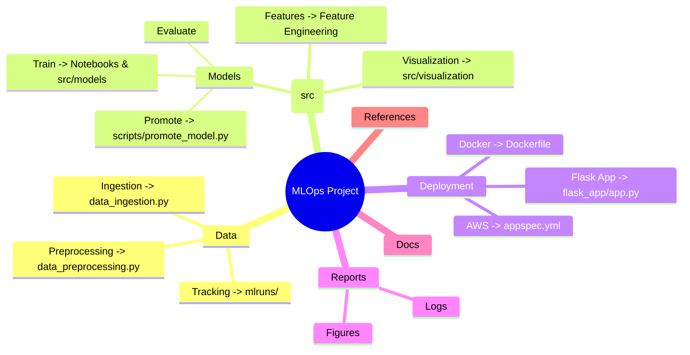
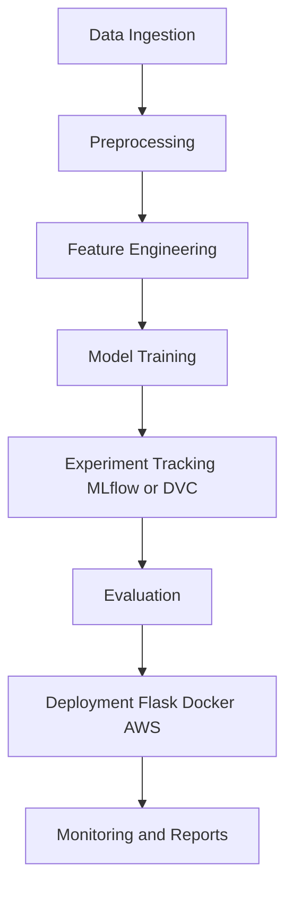

# 🚀 ML Project with MLOps

> A **production-ready Machine Learning pipeline** built with MLOps best practices.  
> Covers **data ingestion, preprocessing, feature engineering, model training, evaluation, deployment, and monitoring**.  
> Modular • Scalable • Reproducible

---

## 📛 Badges


---

## 🧠 Project Mindmap



---

## 🔄 Workflow (Flowchart)




---

## 📂 Project Structure

```
├── Dockerfile              <- Containerization
├── Makefile                <- Automation commands
├── dvc.yaml / params.yaml  <- DVC pipelines & configs
├── requirements.txt        <- Dependencies
├── setup.py                <- Installable package
├── tox.ini                 <- Testing config
├── .github/workflows/ci.yaml <- CI/CD workflow
│
├── flask_app/              <- Flask API for deployment
│   ├── app.py
│   ├── preprocessing_utility.py
│   ├── templates/
│
├── src/                    <- Source code
│   ├── data/
│   │   ├── data_ingestion.py
│   │   ├── data_preprocessing.py
│   ├── features/
│   ├── visualization/
│
├── notebooks/              <- Experiment notebooks
├── models/                 <- Trained models
├── reports/figures/        <- Results & plots
├── scripts/promote_model.py <- Model promotion
├── docs/                   <- Documentation (Sphinx)
```

---

## ⚡ Quickstart

### 1️⃣ Clone the repo

```bash
git clone https://github.com/username/ML-Project-build-using-mlops-main.git
cd ML-Project-build-using-mlops-main
```

### 2️⃣ Install dependencies

```bash
pip install -r requirements.txt
pip install -e .
```

### 3️⃣ Run with Makefile

```bash
make data        # Run data ingestion + preprocessing
make train       # Train models
make deploy      # Deploy with Docker/Flask
```

---

## 📊 Usage

Train a model:

```bash
python src/models/train_model.py
```

Promote a model:

```bash
python scripts/promote_model.py
```

Run Flask app:

```bash
python flask_app/app.py
```

Build docs:

```bash
cd docs
make html
```

---

## 🤝 Contributing

1. Fork this repo  
2. Create a branch (`git checkout -b feature-name`)  
3. Commit changes (`git commit -m "New feature"`)  
4. Push (`git push origin feature-name`)  
5. Open a Pull Request 🚀  

---

## 📜 License

Distributed under the **MIT License**. See `LICENSE` for details.

---

✨ *Scalable • Automated • CI/CD Powered* ✨

